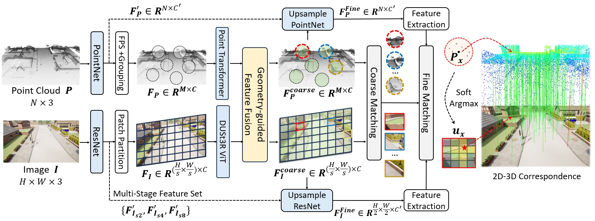
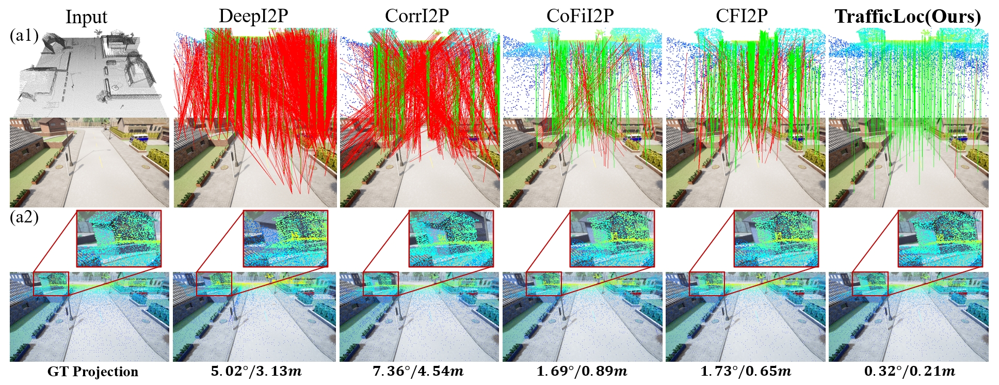

# Introduction
This is the official PyTorch implementation of **`TrafficLoc`** **[ICCV 2025]**
[[Project page](https://tum-luk.github.io/projects/trafficloc/)], [[Paper](https://arxiv.org/abs/2312.14132)]  






# Environment Installation
We use Python 3.9, Pytorch 1.12.1 and CUDA 11.3.1


```shell
# clone repository
git clone https://github.com/TUM-Luk/TrafficLoc.git

# create conda environment
conda create -n trafficloc python=3.9

# install pytorch
conda install pytorch==1.12.1 torchvision==0.13.1 torchaudio==0.12.1 cudatoolkit=11.3 -c pytorch

# install required packages
pip install -r requirement.txt

```


# DATASET

### Carla Intersection Dataset
We provide our Carla Intersection Dataset in [Baidu Cloud Dist Link](https://pan.baidu.com/s/19jWK6HVNl25sCmS4TMva5g?pwd=g9fk) (code: g9fk). Please remain ~400GB storage space before downloading it.

For introduction of Carla Intersection Dataset, please refer to the [README.md](./DATASET/README.md) in DATASET folder.

To generate training and query files, you should following the codes below. 

When generating query file, remember to run the [generate_query_file.py](./DATASET/generate_query_file.py) twice. By setting the variable `is_seq5` to `True` and `False`, you can generate the query file for Test split **`T1-T7`** and **`T1-T7_hard`**

```shell
# generate the dataset folder
python DATASET/transform_dataset.py

# generate training label files
python DATASET/generate_label_file.py
python DATASET/generate_label_txt.py

# generate evaluation label files
python DATASET/generate_query_file.py  # set is_seq5=False
python DATASET/generate_query_file.py  # set is_seq5=True
python DATASET/generate_query_txt.py

```

After running the code, you should see the `train_list` folder in your dataset folder, which contains training and query txt. During the training, the validation set is a combination of all three Test splits.

```
demo_dataset
├── t1_int1
│   ├── mapping
│   ├── query
│   ├── train_list_v50_s25_io03_vo025  # new folder
│       ├── query_t1_int1_v50_s25_io03_vo025.npy
│       ├── seq5_query_t1_int1_v50_s25_io03_vo025.npy
│       ├── train_all_50_0.npy
│       ├── train_all_50_1.npy
│       ├── ......
│       ├── train_all_50_8.npy
├── t1_int2
├── t1_int3
├── ......
├── train_list  # new folder
│   ├── train_allscene_v50_s25_io03_vo025.txt  # Train
│   ├── query_all_3testset_v50_s25_io03_vo025.txt  # Val
│   ├── query_all_1to7_v50_s25_io03_vo025.txt  # Test T1-T7
│   ├── query_all_1to7_v50_s25_io03_vo025_seq5.txt  # Test T1-T7_hard
│   ├── query_t10_int1_v50_s25_io03_vo025.txt  # Test T10
│   ├── xxxxxx.txt  # train & val file for *one* intersection
```

### KITTI Dataset
We use the prepared KITTI dataset provided by [CorrI2P](https://github.com/rsy6318/CorrI2P). Unzip the downloaded files, and the directory is as follows:

```
kitti_data
├── calib
    ├── 00
    ├── 01
    ├── ......
    ├── 10
├── sequences
    ├── 00
    ├── 01
    ├── ......
    ├── 10
```

### Nuscenes dataset
We use the prepared Nuscenes dataset provided by [CorrI2P](https://github.com/rsy6318/CorrI2P). You can also use the script for preparing Nuscenes dataset in **nuScenes_script** folder from the [CorrI2P](https://github.com/rsy6318/CorrI2P) repository.

```
nuscenes_data
├── train
    ├── img
    ├── K
    ├── PC
├── test
    ├── img
    ├── K
    ├── PC

```

# Training & Evaluation

For training on Carla Intersection Dataset

```shell
# Train on Carla Intersection Dataset
sh scripts/train_scripts/train_carla.sh

# Train on KITTI Dataset
sh scripts/train_scripts/train_kitti.sh

# Train on Nuscenes Dataset
sh scripts/train_scripts/train_nuscenes.sh

```


For evaluation on Carla Intersection Dataset

```shell
# Test on Carla Intersection Dataset
sh scripts/test_scripts/test_carla.sh

# Test on KITTI Dataset
sh scripts/test_scripts/test_kitti.sh

# Test on Nuscenes Dataset
sh scripts/test_scripts/test_nuscenes.sh

```

For pretrained DUSt3R Encoder weights, we use [DUSt3R_ViTLarge_BaseDecoder_512_dpt.pth](https://download.europe.naverlabs.com/ComputerVision/DUSt3R/DUSt3R_ViTLarge_BaseDecoder_512_dpt.pth). You can download it from the [DUSt3R](https://github.com/naver/dust3r/tree/main).

For evaluation, we also provide the pretrained model.

| Modelname   | Trained Dataset |
|-------------|----------------------|
| [`trafficloc_carla.pth`](https://drive.google.com/file/d/1RHqDf4xpDRItnXiGAqK1-vqeTRswtrUM/view?usp=sharing) | Carla Intersection Dataset |
| [`trafficloc_kitti.pth`](https://drive.google.com/file/d/1U9SU6HCRPZLIKebwL3UZyVLP93nNH_eL/view?usp=sharing)   | KITTI Odometry |
| [`trafficloc_nuscenes.pth`](https://drive.google.com/file/d/1g2GMZT4cveFCs8X29V4dJq-O0vwQvht7/view?usp=sharing) | Nuscenes |

# Citation

```
@string{iccv="IEEE International Conference on Computer Vision (ICCV)"}
@inproceedings{xia2025trafficloc,
 title = {TrafficLoc: Localizing Traffic Surveillance Cameras in 3D Scenes},
 author = {Y Xia and Y Lu and R Song and O Dhaouadi and JF Henriques and D Cremers},
 booktitle = {IEEE International Conference on Computer Vision (ICCV)},
 year = {2025},
 titleurl = {trafficloc.png},
 keywords = {3D Localization, Traffic Surveillance Camera, LiDAR point cloud},
 url = {https://tum-luk.github.io/projects/trafficloc/},
}
```

# Acknowledgement
We sincerely thank the authors of [DeepI2P](https://github.com/lijx10/DeepI2P/tree/main), [CorrI2P](https://github.com/rsy6318/CorrI2P), [CoFiI2P](https://github.com/WHU-USI3DV/CoFiI2P) for their public codes as well as their prepared KITTI and NuScenes Dataset.

We also want to thank the authors of [NeuMap](https://github.com/Tangshitao/NeuMap/tree/master), as our project is built based on their public codes.